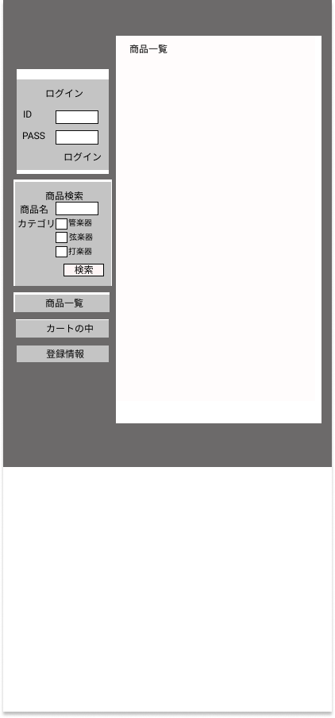

### 画面詳細図
## トップページ
### プロトタイプは以下のリンク集
[プロトタイプ](https://www.figma.com/file/5TNn5hMKarPFLmWIexSNYm/Untitled?node-id=0%3A1)
*****

*****
補足：対応DBの列はDB設計後、〇を対応するテーブル・カラム名に差し替えること
| ID | 要素 | 内容 | アクション | イベント | 対応DB |
|----|------|------|------------|----------|--------|
|1   |バナー|サイト名表示|-      |-         |-       |
|2   |ログイン|テキスト画像|-    |-         |-       |
|3   |ID     |入力欄     |テキスト入力|-    |〇      |
|4   |PASS   |入力欄     |テキスト入力|-    |〇      |
|5   |ログインボタン|ボタン|クリック  |ログイン処理実行|-|
|6   |商品検索|テキスト画像|-  |-          |-        |
|7   |商品名  |テキスト表示|-  |-          |-        |
|8   |商品名  |入力欄      |テキスト入力|-   |〇     |
|9   |カテゴリ|テキスト表示|-  |-          |-        |
|10  |管楽器  |テキスト表示|-   |-         |-        |
|11  |管楽器  |チェックボックス|選択  |-    |〇      |
|12  |弦楽器  |テキスト表示|-     |-       |-        |
|13  |弦楽器  |チェックボックス|選択   |-    |〇     |
|14  |打楽器　|テキスト表示|-     |-        |-       |
|15  |打楽器　|チェックボックス|選択　　|-  |〇　　　|
