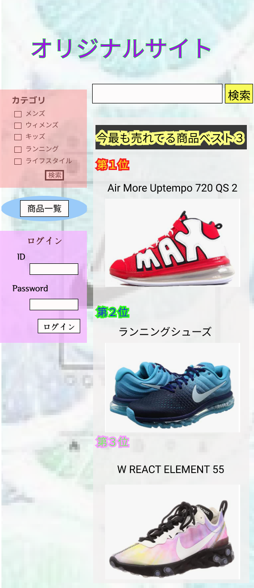

### 画面詳細図
## トップページ
### プロトタイプは以下のリンク集
[プロトタイプ](https://www.figma.com/file/5TNn5hMKarPFLmWIexSNYm/Untitled?node-id=23%3A0)
*****

*****
補足：対応DBの列はDB設計後、〇を対応するテーブル・カラム名に差し替えること
| ID | 要素 | 内容 | アクション | イベント | 対応DB |
|----|------|------|------------|---------|--------|
|||||||
|||||||
|||||||
|||||||
|||||||
|||||||
|||||||
|||||||
|||||||
|||||||
|||||||
|||||||
|||||||
|||||||
|||||||
|||||||
