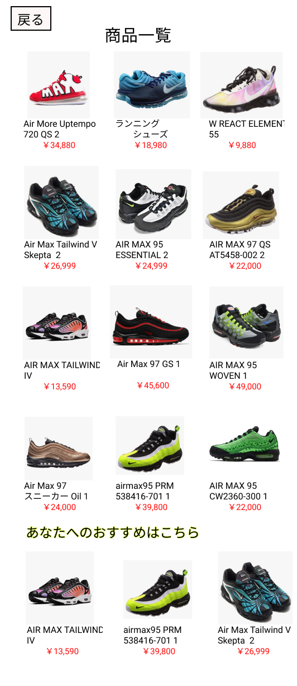

### 画面詳細図
## 商品一覧
### プロトタイプは以下のリンク集
[プロトタイプ](https://www.figma.com/file/5TNn5hMKarPFLmWIexSNYm/Untitled?node-id=23%3A0)
*****

*****
補足：対応DBの列はDB設計後、〇を対応するテーブル・カラム名に差し替えること
| ID | 要素 | 内容 | アクション | イベント | 対応DB |
|----|------|------|------------|---------|--------|
|1 |商品一覧  |テキスト画像   |-        |-   |-  |
|2 |商品      |画像リンク     |クリック   |商品詳細へ遷移  |〇 |
|3 |商品名    |テキスト表示     |-        |-   |-  |
|4 |金額      |テキスト表示   |-     |-   |-|
|5 |戻る      |ボタン         |クリック   |前の画面へ遷移  |〇 |
|6 |テキスト  |テキスト画像   |-         |-      |-   |
|7 |商品      |画像リンク     |クリック   |商品詳細へ遷移  |〇 |
|8 |商品名    |テキスト表示     |-        |-   |-  |
|9 |金額      |テキスト表示   |-     |-   |-|
